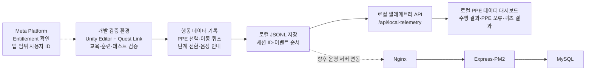
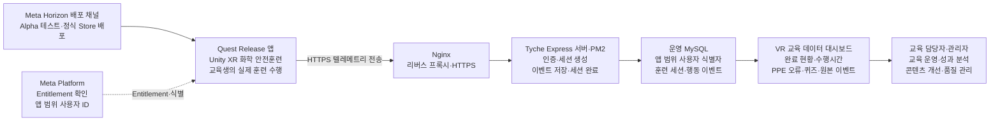

# 화학 안전 VR 시스템 구성

## 목적

이 문서는 최종 발표에서 사용할 화학 안전 VR의 현재 데이터 검증 구조와 Meta Horizon 입점 이후 운영 목표 구조를 구분한다. Meta 심사 통과, 코드 구현, 실제 데이터 수집, 서버 저장과 대시보드 조회를 서로 다른 완료 단계로 표시하여 구현 상태를 과장하지 않는 것을 원칙으로 한다.

## 문서 기준

- 서버 저장소 구현·운영 반영 기준: `softCastella/chemical-safety-vr-server` `main@5b8138865991408215011078328f74a0df229982`
- 클라이언트 저장소: `softCastella/chemical-safety-vr-client` `main@b840b2dc2e4d0235c087fb4693a1486bd21dab9c`
- 실행 데이터 기준: 2026-09-08 Unity Editor와 Quest Link로 수집한 6개 시나리오·모드 조합
- 이 문서는 위 커밋의 코드와 `Docs/MeetingNotes/2026-08-30_Client_Server_Auth_Channel_Handoff.md`, `Docs/ProductionDeployment.md`의 검증 기록을 기준으로 작성했다.
- 클라이언트 Release 전송 코드는 정적·Editor 하네스를 통과했지만 code 6 Release APK와 Quest 실기 검증 전이므로 실제 Quest Release 동작을 확정 사실로 확대하지 않는다.

## 현재 VR 교육 데이터 검증 구조

현재 확인된 경로는 Unity Editor와 Quest Link 실행에서 로컬 JSONL을 생성하고, Express의 로컬 텔레메트리 API를 통해 PPE 데이터 대시보드가 이를 조회하는 구조다.

- 실선은 현재 코드와 실행 데이터로 확인한 로컬 검증 경로다.
- 점선은 Meta 연동 또는 향후 운영 서버 연동을 나타낸다.
- 현재 대시보드는 `/api/local-telemetry`를 호출하여 로컬 JSONL을 조회한다.
- 현재 채택한 기준 데이터는 Quest 단독 Release 앱이 아니라 Unity Editor와 Quest Link에서 수집했다.

발표 슬라이드 제목은 `현재 VR 교육 데이터 검증 구조`를 사용한다. 하단 요약 문구는 다음과 같이 작성한다.

> 현재 단계에서는 VR 행동 데이터의 수집·저장·대시보드 시각화 구조를 로컬 환경에서 검증하고 있습니다.

## Meta Horizon 입점 이후 운영 목표 구조

Meta의 Alpha 등 배포 채널 또는 Store 심사를 통과한 뒤에도 심사 통과만으로 운영 연동이 완료되지는 않는다. Quest Release 앱의 실제 HTTPS 전송, 운영 MySQL 적재, 인증된 대시보드 조회까지 통합 검증한 뒤에 운영 시스템으로 전환한다. 단, Alpha 심사 기간에 원본을 잃지 않도록 Release HTTPS 전송과 인증 경로는 Alpha 제출 전에 구현·검증한다.

발표 슬라이드 제목은 현재 통합 상태에서 `Meta Horizon 입점 이후 운영 목표 구조`를 사용한다. Release 앱부터 대시보드까지 운영 검증이 완료된 뒤에만 제목을 `Meta Horizon 운영 시스템 구성`으로 변경한다.

하단 요약 문구는 다음과 같이 작성한다.

> 교육생의 VR 행동을 세션과 이벤트 단위로 기록하고, 교육 성과와 콘텐츠 개선 근거로 활용한다.

## 구성요소와 역할

| 구성요소 | 역할 | 현재 상태 |
| --- | --- | --- |
| Meta Platform | 앱 Entitlement와 앱 범위 사용자 ID를 제공한다. | Editor 검증 기록이 있으며 Quest Release 환경은 별도 검증이 필요하다. |
| Unity XR 클라이언트 | 교육 흐름을 실행하고 PPE 조작, 퀴즈, 단계 전환과 음성 안내 이벤트를 기록한다. | Unity Editor와 Quest Link에서 기준 데이터를 수집했다. |
| 로컬 JSONL | 네트워크 전송 전 원본 세션과 이벤트 순서를 보존한다. | 현재 대시보드와 기준 데이터 검증의 원본이다. |
| Nginx | 운영 HTTPS 종단과 Express 리버스 프록시를 담당한다. | 공개 웹과 관리자 서비스에 사용 중이며 VR 운영 전송은 별도 적용·검증 대상이다. |
| Express·PM2 | 텔레메트리 인증, 세션 생성, 이벤트 저장, 세션 완료와 조회 API를 제공한다. | 서버 코드와 자동 테스트가 존재한다. |
| MySQL | 참여자, 앱 범위 식별정보, 훈련 세션과 행동 이벤트를 저장한다. | 테이블 migration과 저장소 코드가 존재하며 운영 VR 수집은 완료되지 않았다. |
| VR 교육 데이터 대시보드 | 교육 완료, 수행시간, PPE·퀴즈 결과와 원본 이벤트를 조회한다. | 현재 화면은 로컬 JSONL API를 사용하며 운영 공개는 차단되어 있다. |
| 교육 담당자·관리자 | 교육 운영 상태를 확인하고 콘텐츠 개선 근거를 검토한다. | 운영 대시보드 인증·권한과 실제 데이터 조회의 통합 검증이 남아 있다. |

## 데이터 계약

### 현재 로컬 조회

- `GET /api/local-telemetry/sessions`
- `GET /api/local-telemetry/sessions/{sessionId}`
- PPE 데이터 대시보드는 위 API를 통해 로컬 JSONL의 세션과 원본 이벤트를 조회한다.

### 서버 텔레메트리

- `POST /api/training-telemetry/sessions`
- `POST /api/training-telemetry/sessions/{sessionId}/events`
- `POST /api/training-telemetry/sessions/{sessionId}/complete`
- `GET /api/training-telemetry/sessions`
- `GET /api/training-telemetry/sessions/{sessionId}`
- `GET /api/training-telemetry/participants`
- `GET /api/training-telemetry/participants/{participantId}`

현재 서버 API는 업로드 Bearer token을 검사한다. 이 개발용 토큰을 입점 후 장기 운영 인증으로 확정하지 않는다. Release 운영 인증은 Meta 검증과 서버가 발급하는 단기 자격 증명, 전송 제한과 권한 정책을 별도로 구현하고 검증해야 한다.

## 완료 상태 구분

| 검증 단계 | 상태 | 근거와 제한 |
| --- | --- | --- |
| 코드에 존재함 | 확인 | 로컬 텔레메트리와 MySQL 텔레메트리 라우터, 저장소와 migration이 존재한다. |
| 클라이언트 실행에 연결됨 | 부분 확인 | Unity Editor와 Quest Link에서 로컬 JSONL 수집을 확인했다. Quest 단독 Release 앱 업로드는 확인하지 않았다. |
| 실행 로그로 수집됨 | 확인 | 6개 시나리오·모드 기준 회차의 로컬 JSONL을 채택했다. |
| 서버에서 수신·저장됨 | 부분 확인 | 개발 환경 업로드 계약과 일부 복구 경로를 확인했지만 채택한 6개 기준 회차의 DB 대조는 완료되지 않았다. |
| 대시보드에서 조회됨 | 로컬 확인 | 로컬 JSONL 기반 대시보드를 확인했다. 운영 MySQL 기반 대시보드 조회는 완료되지 않았다. |
| 운영 공개·권한 검증 | 미완료 | VR 데이터용 `/dashboard/`는 공개하지 않았으며 관리자 권한 분리와 운영 조회를 검증해야 한다. |

## 운영 전 완료 조건

1. Quest Release 앱에서 개발용 장기 토큰과 cleartext HTTP를 제거한다.
2. 운영과 같은 staging HTTPS 환경에서 인증, 배치 업로드, 중복 방지, 재전송과 세션 완료 복구를 확인한다.
3. 같은 `sessionId`에 대해 Quest 원본 JSONL, 서버 이벤트 수, 마지막 sequence와 MySQL 상세 조회가 일치하는지 확인한다.
4. 관리자 인증과 VR 데이터 조회 권한을 적용하고 서버 상태 데이터와 교육 데이터를 분리한다.
5. 운영 데이터의 보존, 백업, 조회 pagination, 전송량 제한과 장애 복구 절차를 마련한다.
6. 클라이언트와 서버의 대상 브랜치·커밋, API·DB 계약과 실제 staging 이벤트를 대조한다.
7. 위 검증을 완료한 뒤 발표 자료의 점선 운영 경로를 실선으로 변경한다.

## 영향 범위

- 이 문서는 발표 구성도와 시스템 상태 설명의 기준을 추가한다.
- 서버 API, DB schema, 환경 변수, 운영 배포와 클라이언트 런타임은 변경하지 않는다.
- 실제 사용자 데이터, Meta 앱 범위 사용자 ID, 토큰과 운영 자격 증명은 문서에 기록하지 않는다.

## 문서 동기화 상태

- 서버 문서 작성: 완료
- 클라이언트 같은 상대 경로 반영: 완료
- 양쪽 `Docs/SharedDocumentManifest.md` 반영: 완료
- 이후 어느 저장소에서든 공용 사실을 변경하면 두 파일 내용과 기준 커밋을 다시 대조한다.
